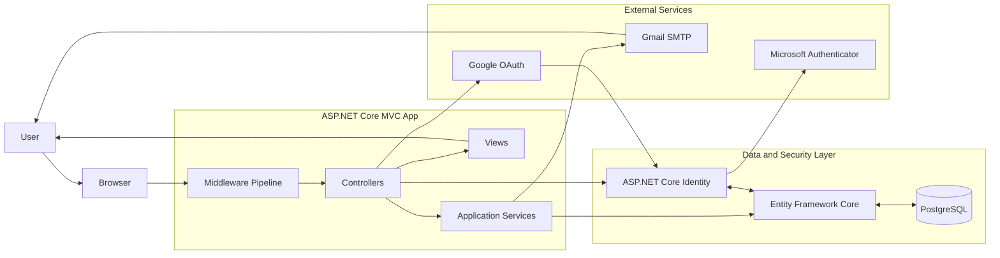

# SakilaApp

SakilaApp is an ASP.NET Core MVC application built on top of the Sakila database and extended with modern identity, authentication, and messaging features.

It combines:

- ASP.NET Core MVC for the web layer
- Entity Framework Core for data access
- PostgreSQL for persistence
- ASP.NET Core Identity for local authentication and authorization
- Google OAuth for external sign-in
- Gmail SMTP for email delivery
- Microsoft Authenticator for multi-factor authentication

## Architecture Overview



## Main Features

- Local account registration and login
- Google authentication
- Email confirmation
- Password recovery
- Password change
- Two-factor authentication with an authenticator app
- Role-based access control
- PostgreSQL persistence for Identity and Sakila data
- Protected areas for employees and administrators

## Roles

- Administrator
- Employee

## Protected Areas

- `Home/Dashboard` for authenticated users
- `Employee/Dashboard` for employees and administrators
- `Admin/Dashboard` for administrators only
- `Films`, `Actors`, `Categories`, `Consultas`, `FilmCategories`, and `Languages` controllers require authentication

## Requirements

- .NET 10 SDK
- PostgreSQL
- Gmail account with an application password
- Google OAuth credentials

## Configuration

Configure secrets or environment variables for the values below:

- `ConnectionStrings:DefaultConnection`
- `Authentication:Google:ClientId`
- `Authentication:Google:ClientSecret`
- `EmailSettings:SmtpServer`
- `EmailSettings:SmtpPort`
- `EmailSettings:SenderName`
- `EmailSettings:SenderEmail`
- `EmailSettings:Password`

## Run Locally

```bash
dotnet restore
dotnet build
dotnet run
```

## Notes

- Email confirmation is required before a local account can sign in.
- Identity tables are stored in PostgreSQL using Entity Framework Core migrations.
- The project includes a custom authenticator setup page at `Areas/Identity/Pages/Account/Manage/EnableAuthenticator`.
- The application uses a shared PostgreSQL connection for both the Sakila data model and Identity.

## Project Structure

- `Controllers/` application controllers and protected areas
- `Data/` EF Core database contexts
- `Models/` domain and view models
- `Services/` email and supporting services
- `Settings/` strongly typed configuration
- `Views/` MVC and Razor UI
- `Areas/Identity/` identity UI pages

